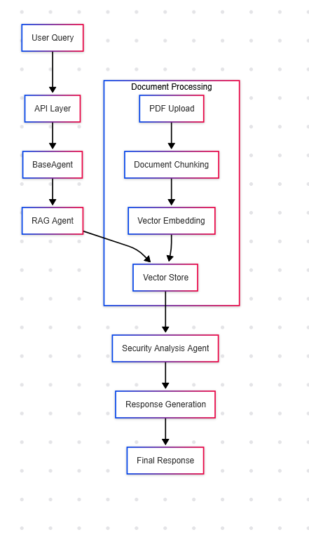
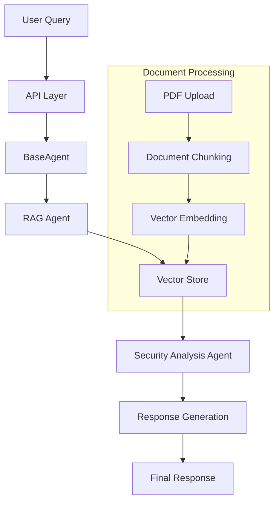

# Read Me to help with integration

# Security RAG System

Retrieval-Augmented Generation (RAG) system specialized for security analysis, built using LangGraph, LangChain, and FastAPI. The system employs a multi-agent approach to process security-related queries with context-aware responses.

## System Architecture

### Core Components

1. **Vector Store (Chroma)**
   - Manages document embeddings and similarity search
   - Configured via `database_manager.py` and `init_chroma.py`
   - Uses Ollama embeddings for document vectorization

2. **Document Processing Pipeline**
   - Handles PDF document loading via `web_doc_loader.py`
   - Implements text chunking through `doc_chunker.py`
   - Supports both local and uploaded documents

3. **LLM Integration**
   - Uses Ollama as the base LLM
   - Configured in `llm.py`
   - Default model: granite3.1-dense:2b

4. **Multi-Agent Workflow**
   - Defined in `graph_config.py`
   - Implements a security-focused RAG pipeline
   - Includes specialized agents for context retrieval and security analysis

### Current Pipeline Flow





## Component Interactions

### 1. Database Layer
- `database_manager.py`: Central class managing vector store operations
- `init_chroma.py`: Initializes Chroma vector store
- `db_query.py`: Handles RAG queries and prompt templates

### 2. Document Processing
- `web_doc_loader.py`: Loads documents from web URLs and local PDFs
- `doc_chunker.py`: Splits documents into manageable chunks
- Storage in `./chroma` directory with SQLite backend

### 3. Agent System
- `base_agent.py`: Orchestrates the multi-agent workflow
- `graph_config.py`: Defines the LangGraph workflow
- Implements state management and agent transitions

### 4. API Layer
- FastAPI-based REST API
- Endpoints for queries and document management
- Swagger UI available at `/docs`

## Configuration

Environment variables (`.env`):
```ini
LLM_MODEL=granite3.1-dense:2b
LLM_BASE_URL=http://localhost:11434
COLLECTION_NAME=general_docs
PERSIST_DIRECTORY=./chroma
EMBEDDING_MODEL=nomic-embed-text
```

## API Endpoints

### Query Endpoint
```http
POST /query
Content-Type: application/json

{
    "query": "What are the security implications of using JWT tokens?"
}
```
Expected Response:
```json
{
    "response": "Detailed security analysis and recommendations..."
}
```

### Document Upload
```http
POST /documents/upload
Content-Type: multipart/form-data

file: <PDF_FILE>
```
Expected Response:
```json
{
    "status": "success",
    "filename": "document.pdf",
    "pages_processed": 5,
    "chunk_count": 15
}
```

### Database Statistics
```http
GET /database/stats
```
Expected Response:
```json
{
    "total_documents": 100,
    "collection_name": "general_docs",
    "persist_directory": "./chroma",
    "last_updated": "2024-02-22T10:30:00Z"
}
```

### Clear Database
```http
POST /database/clear
```
Expected Response:
```json
{
    "status": "success",
    "deleted_count": 100
}
```

### Graph Visualization
```http
GET /graph
```
Expected Response:
```json
{
    "mermaid": "graph TD\n..."
}
```

## Local Development

1. Install dependencies:
```bash
pip install -r requirements.txt
```

2. Start the API:
```bash
uvicorn api:app --reload
```

3. Access Swagger UI:
```
http://localhost:8000/docs
```

## Project Structure
```
app/
├── agent/           # Agent orchestration
├── database/        # Vector store and query handling
├── doc_loader/      # Document processing
├── llm/            # LLM configuration
├── workflow/        # LangGraph workflow
└── logs/           # Debug logs
```

## Error Handling and Logging
- Debug logs stored in `logs/rag_debug.log`
- Comprehensive error tracking in API endpoints
- State management through LangGraph checkpointing

## Implementation Notes

1. **Vector Store Management**
   - Uses Chroma for document storage
   - Implements batch processing for large documents
   - Supports document updates and deletion

2. **Security Analysis**
   - Context-aware security assessment
   - Source attribution for recommendations
   - Multi-step analysis pipeline

3. **Document Processing**
   - Recursive text splitting
   - Metadata preservation
   - PDF-specific handling

4. **State Management**
   - Conversation history tracking
   - Context preservation between queries
   - Checkpoint-based recovery